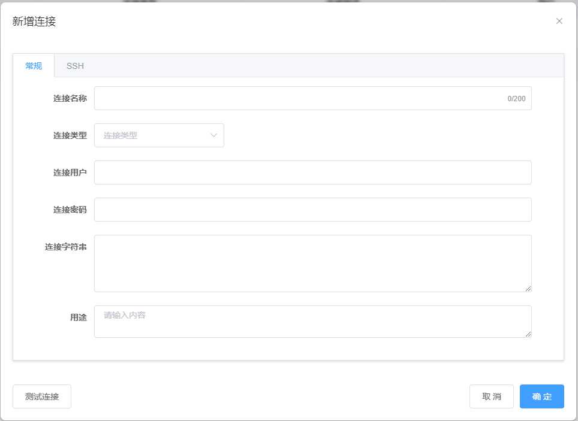
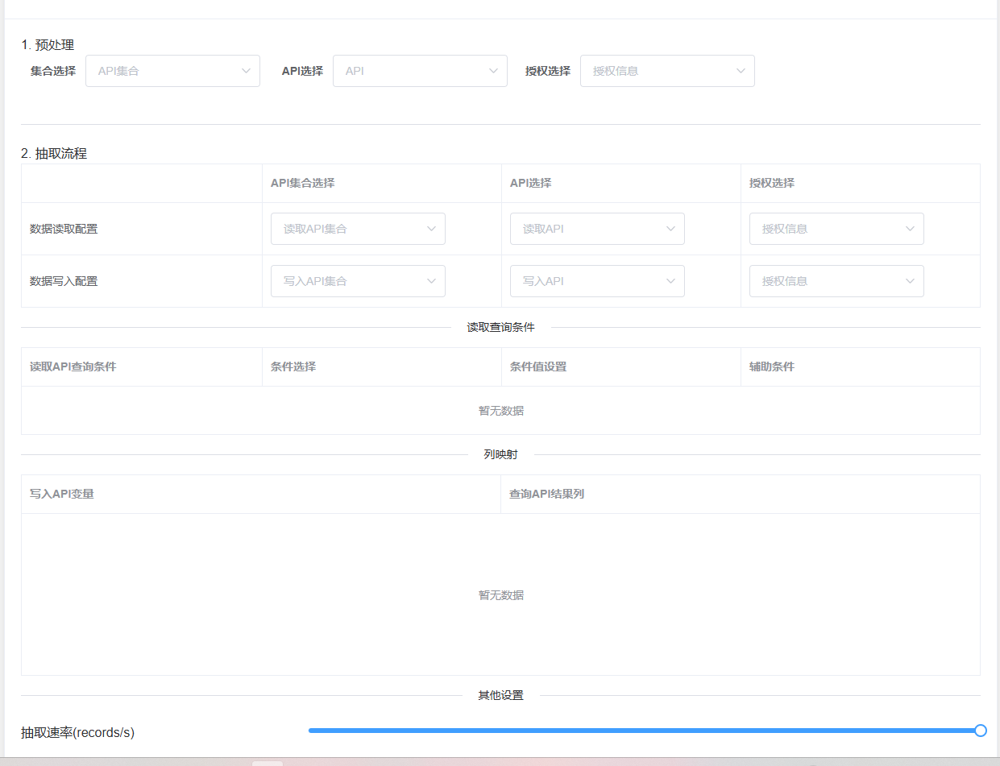

  

<h4 align="center">
N-Report - 白龙须 - 让报表制作更高效
</h4>

  <a target="_blank" href="https://docs.commapi.bailongxu.com/">🏠 官网</a> &nbsp; | &nbsp;
  <a target="_blank" href="https://docs.commapi.bailongxu.com/zh/%E6%8A%80%E6%9C%AF%E6%96%87%E6%A1%A3">📖 文档</a> &nbsp; | &nbsp;
  <a target="_blank" href="https://demo.report.bailongxu.com/commapi/#/login">🔍 演示环境</a> &nbsp; | &nbsp;

## 👋 项目介绍

N-Api 是“白龙须”旗下的一款产品，是一款**SQL 到 API 的零代码开发平台**，让开发者通过简单的 SQL 查询即可快速构建功能完整的 RESTful API，无论是前端开发人员、数据分析师还是业务专家，都能轻松地将数据库中的数据转换为可随时调用的数据服务接口

N-Api 支持丰富的数据源，通过划词的方式快速构建Api，并生成支持在线测试的交互式Api文档，支持一键导出PDF帮助开发人员更方便快捷地管理Api

## ✨ 核心特性

### 🔄 SQL 到 API 的即时转换

-   **零代码开发**：只需编写标准 SQL 查询，系统自动生成对应的 RESTful API 端点
-   **广泛数据源支持**：兼容 MySQL、PostgreSQL、Oracle、SQL Server 等十几种主流数据源，详见[多源数据支持](https://docs.nthing.bailongxu.com/zh/%E6%8A%80%E6%9C%AF%E6%96%87%E6%A1%A3/%E9%85%8D%E7%BD%AE%E6%95%B0%E6%8D%AE%E6%BA%90)
-   **智能参数映射**：支持参数化查询，自动将 API 请求参数安全地映射到 SQL 条件中

### 📊 完整的 CRUD 操作

-   **开箱即用的数据操作**：自动为每个数据表生成标准的增删改查（CRUD）端点
-   **高级查询能力**：支持复杂查询、多表关联、聚合函数等高级 SQL 功能
-   **事务支持**：关键业务操作支持数据库事务，确保数据一致性

### 📄 智能 API 文档管理

-   **一键导出 PDF 文档**：自动生成精美的 API 参考文档，支持一键导出为 PDF 格式
-   **交互式文档**：内置 API 探索界面，可直接在浏览器中测试接口
-   **实时同步**：代码变更即时反映在 API 文档中，杜绝文档滞后问题

### 📁 强大的文件池集成

-   **统一文件管理**：通过链接文件池，实现文件的上传、下载、删除和修改操作
-   **元数据管理**：每个文件均可关联丰富的元数据，支持复杂查询和筛选
-   **版本控制**：重要文件自动版本记录，可回溯历史版本

### 🛡️ 企业级安全特性

-   **精细化权限控制**：基于角色的访问控制（RBAC），精确到 API/数据表级别
-   **全面审计日志**：记录所有 API 调用详情，便于安全审计和故障排查
-   **SQL 注入防护**：内置参数化查询和安全检查，有效防范安全威胁

### 📊 功能对比 

-   **核心功能比较**

|     |     |     |     |
| --- | --- | --- | --- |
| **特性** | **N-Api** | **传统开发方式** | **其他 SQL2API 工具** |
| 开发时间 | **分钟级**​ | 天级  | 小时级 |
| 技术要求 | **SQL 知识**​ | 全栈开发技能 | SQL + 配置 |
| 文档生成 | **一键导出 PDF**​ | 手动编写 | 部分支持 |
| 文件管理 | **内置文件池**​ | 自行实现 | 有限支持 |
| 部署复杂度 | **一键部署**​ | 复杂配置 | 中等复杂度 |

查看 [演示环境](https://demo.report.bailongxu.com/commapi/)

## 🔥 核心能力

#### 🧩 核心能力展示

|     |     |
| --- | --- |
| 多数据源支持 |  |
| 划词生成Api |  |
| 交互式Api文档 |  |
| 数据交换管理 |  |
| 文件池API |  |

## 🚀 上手指南

#### 📦 安装

查看 [安装N-Api](https://docs.commapi.bailongxu.com/zh/N-Api%E5%AE%89%E8%A3%85%E9%83%A8%E7%BD%B2)

#### ⚙️ 配置报表应用

查看 [快速配置](https://docs.commapi.bailongxu.com/zh/school)

#### N-Api可以投入生产使用吗

是的，已经有不少用户将白龙须投入生产使用。

#### 🙋‍♂️ 用户社区

欢迎加入N-Api社区[微信](https://docs.report.bailongxu.com/zh/buy/code)交流群进行技术交流。

#### 💪 专业版

查看 [个人版 vs 专业版](https://docs.report.bailongxu.com/zh/buy)
